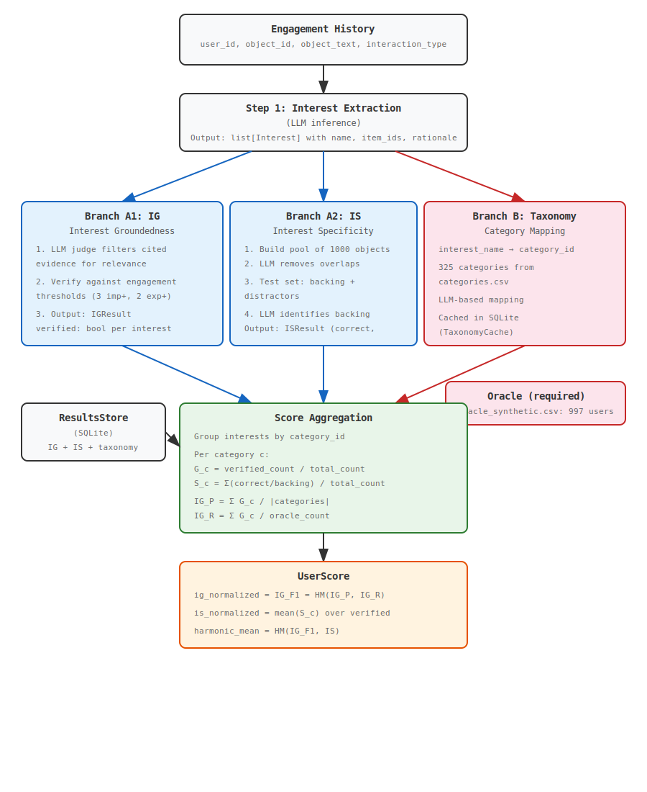

# GISTBench — Instructions

## Overview

GISTBench (**G**roundedness & **I**nterest **S**pecificity **T**est Bench) evaluates how well LLMs understand users from their engagement history. Given a user's interactions with content (videos, articles, books, etc.), the benchmark measures whether an LLM can:

1. **Extract meaningful interests** from engagement history
2. **Ground those interests in evidence** (Interest Groundedness — IG)
3. **Cite specific, relevant items** for each interest (Interest Specificity — IS)

The final score is the **harmonic mean** of IG and IS, rewarding models that are both well-grounded and specific.

## Requirements

- Python >= 3.10
- An OpenAI-compatible API key (OpenAI, Azure OpenAI, or any `/v1/chat/completions` provider)

### Dependencies

| Package | Purpose |
|---|---|
| `openai` | LLM inference via OpenAI-compatible APIs |
| `pandas` | Data loading and manipulation |
| `click` | Command-line interface |
| `datasets` | Hugging Face dataset loading |
| `pytest` | Testing (dev only) |

## Installation

```bash
# Clone the repository
git clone https://github.com/facebookresearch/GISTBench.git
cd GISTBench

# Option 1: conda
conda create -n gistbench python=3.10 -y
conda activate gistbench

# Option 2: venv (if conda is unavailable)
python3 -m venv .venv
source .venv/bin/activate

# Install the package with dev dependencies
pip install -e ".[dev]"
```

### Environment Setup

Create a `.env` file in the project root:

```bash
OPENAI_API_KEY=your-api-key-here
```

Then export it before running:

```bash
export $(cat .env | xargs)
```

## Dataset Format

GISTBench expects engagement data as a CSV, JSON, or JSONL file with the following fields:

| Field | Required | Description |
|---|---|---|
| `user_id` | Yes | Anonymized user identifier |
| `object_id` | Yes | Anonymized object identifier |
| `object_text` | Yes | Text description of the content item |
| `interaction_type` | Yes | One of: `explicit_positive`, `implicit_positive`, `implicit_negative`, `explicit_negative` |
| `interaction_time` | No | Anonymized interaction timestamp |

### Interaction Types

| Type | Meaning | Example |
|---|---|---|
| `explicit_positive` | User actively expressed positive interest | Liked, favorited, rated highly |
| `implicit_positive` | Passive positive signal | Watched fully, clicked through |
| `implicit_negative` | Passive negative signal | Scrolled past, skipped |
| `explicit_negative` | User actively expressed dislike | Downvoted, reported, rated low |

### Supported Datasets

GISTBench includes built-in configurations for six datasets:

| Dataset | Content Type | Signals Available |
|---|---|---|
| `synthetic` | Videos | explicit+, implicit+, implicit- |
| `kuairec` | Videos | explicit+, implicit+, implicit- |
| `mind` | News articles | explicit+, implicit- |
| `amazon_digital_music` | Songs | explicit+, implicit+, explicit- |
| `yelp` | Stores | explicit+, implicit+, explicit- |
| `goodreads` | Books | explicit+, implicit+, explicit- |

Custom datasets are auto-detected from your data — no configuration needed.

## CLI Usage

Every CLI run requires `--results-db` to persist predictions. The oracle (denominator for IG Recall) is built automatically from the union of verified interests across all models once 3+ models have been evaluated.

### Basic Workflow: Evaluate 3+ Models

```bash
export OPENAI_API_KEY=your-key

# Run each model — predictions are saved to the results DB
gistbench run -d data.csv -m gpt-4o      --results-db results.db
gistbench run -d data.csv -m gpt-4o-mini --results-db results.db
gistbench run -d data.csv -m gpt-4-turbo --results-db results.db
```

- **Runs 1–2**: Extraction + IG/IS runs, predictions saved. Terminates early with: *"Need 3 models to build oracle, have N. Run N more."*
- **Run 3+**: Oracle is automatically built from all verified interests across all models. **All models are rescored** and results are displayed:

```
Models in store: 3 (gpt-4-turbo, gpt-4o, gpt-4o-mini)
Building oracle from 3 models and scoring...

--- Results (3 models, 150 scores) ---
  gpt-4-turbo: IG_F1=0.720  IS=0.810  HM=0.763  (50 users)
  gpt-4o:      IG_F1=0.680  IS=0.790  HM=0.731  (50 users) <-- current
  gpt-4o-mini: IG_F1=0.620  IS=0.710  HM=0.662  (50 users)
```

### With Pre-Computed Oracle

If you already have ground truth, skip the 3-model requirement:

```bash
gistbench run -d data.csv -m gpt-4o \
  --results-db results.db \
  --oracle oracle.json
```

Oracle JSON format:

```json
{
  "oracle": {
    "user_1": [16, 133, 42],
    "user_2": [201, 268]
  }
}
```

Values are `category_id` integers from the bundled taxonomy (325 categories).

### Additional Options

```bash
# List available datasets
gistbench datasets

# Evaluate a subset of users
gistbench run -d data.csv -m gpt-4o --results-db results.db -n 50

# Disable LLM judge (faster, less accurate)
gistbench run -d data.csv -m gpt-4o --results-db results.db --no-judge

# Disable taxonomy normalization
gistbench run -d data.csv -m gpt-4o --results-db results.db --no-taxonomy

# Cache taxonomy mappings across runs
gistbench run -d data.csv -m gpt-4o --results-db results.db --taxonomy-cache taxonomy.db

# Save scores to JSON
gistbench run -d data.csv -m gpt-4o --results-db results.db -o scores.json

# Use a local model via Ollama
gistbench run -d data.csv -m llama3 --results-db results.db \
  --base-url http://localhost:11434/v1 --api-key unused

# Verbose logging
gistbench -v run -d data.csv -m gpt-4o --results-db results.db
```

## Python API

### Quick Start

```python
from gistbench.client import OpenAIClient
from gistbench.data import load_dataset, sample_users
from gistbench.steps.pipeline import run_benchmark
from gistbench.store import ResultsStore

# Load data
df = load_dataset("path/to/data.csv")
user_ids = sample_users(df, n=100)

# Run 3 models, saving predictions to a store
store = ResultsStore("results.db")

for model_name in ["gpt-4o", "gpt-4o-mini", "gpt-4-turbo"]:
    client = OpenAIClient(model=model_name)
    run_benchmark(
        client=client,
        df=df,
        user_ids=user_ids,
        oracle=None,  # oracle built from predictions
        dataset_name="synthetic",
        model_name=model_name,
        results_store=store,
    )

# Score all models once 3+ are available
scores = store.rescore_all("synthetic")

for s in scores:
    print(
        f"{s.model} | User {s.user_id}: "
        f"IG={s.ig_normalized:.3f} "
        f"IS={s.is_normalized:.3f} "
        f"HM={s.harmonic_mean:.3f}"
    )

store.close()
```

### With Pre-Computed Oracle

```python
from gistbench.schema import Oracle

oracle = Oracle.from_file("oracle.json")
# or: oracle = load_bundled_oracle()  # bundled 997-user oracle

scores = run_benchmark(
    client=client,
    df=df,
    user_ids=user_ids,
    oracle=oracle,
    dataset_name="synthetic",
    model_name="gpt-4o",
)
```

### Custom LLM Client

Implement the `LLMClient` protocol to use any backend:

```python
from gistbench.client import LLMClient

class MyCustomClient:
    def chat(
        self,
        messages: list[dict[str, str]],
        temperature: float = 0.0,
        max_tokens: int = 4096,
    ) -> str:
        # Your inference logic here
        return "response text"
```

## How Scoring Works

### Dataflow Diagram



### Oracle

The **oracle** defines the set of interest categories (by `category_id`) that are discoverable for each user. It is the denominator for **IG Recall**.

Two ways to obtain the oracle:

1. **Built from predictions** (default): Run 3+ models. The oracle for each user is the union of verified interest categories across all models. This requires `--results-db` and at least 3 models.

2. **Pre-computed**: Load from a JSON file via `--oracle`. The bundled oracle (`gistbench/assets/oracle_synthetic.json`) covers 997 users in the synthetic dataset.

### Pipeline Details

1. **Interest Extraction**: The LLM receives a user's engagement history and extracts interests as structured JSON, citing `object_id`s as evidence.

2. **Interest Groundedness (IG)**: Each interest is verified against the user's data. An LLM judge first filters cited evidence for semantic relevance, then the system checks engagement thresholds:
   - >= 3 `implicit_positive` engagements
   - >= 2 `explicit_positive` engagements
   - >= 1 `explicit_positive` + >= 2 `implicit_positive` engagements

   Negative constraints:
   - <= 3 `implicit_negative` engagements
   - <= 2 `explicit_negative` engagements

3. **Interest Specificity (IS)**: Measures how precisely the LLM cites evidence. A two-stage process: (1) build a shortlist pool removing semantically similar objects, (2) build a test set with backing + distractors. The LLM judge identifies which objects support the interest. Score = correct identifications / backing count.

4. **Interest Category Mapping**: Maps free-form interest names to 325 taxonomy categories (by `category_id`) using an LLM. Prevents score inflation from producing many interests within the same category.

5. **Score Aggregation**: Groups interests by `category_id`, computes per-category groundedness (G_c) and specificity (S_c), then aggregates into IG_P, IG_R, IG_F1, and IS. Final score = HM(IG_F1, IS).

## Running Tests

```bash
# Integration tests (no API key required)
pytest -m "not e2e"

# All tests including end-to-end with real LLM inference
export OPENAI_API_KEY=your-key
pytest -v

# E2E tests only
pytest -m e2e -v -s
```

## Project Structure

```
GISTBench/
├── pyproject.toml                          # Package configuration
├── .env                                    # API keys (not committed)
├── INSTRUCTIONS.md                         # This file
├── gistbench/
│   ├── __init__.py
│   ├── cli.py                              # Command-line interface
│   ├── client.py                           # LLM client protocol & OpenAI backend
│   ├── data.py                             # Data loading, chunking, sampling
│   ├── download.py                         # Dataset download from Hugging Face
│   ├── schema.py                           # Core data types & dataset configs
│   ├── store.py                            # SQLite results store & cross-model oracle
│   ├── assets/
│   │   ├── categories.csv                  # 325 interest categories (category_id, category_name)
│   │   ├── dataflow.svg                    # Pipeline dataflow diagram
│   │   ├── mock_dataset.json               # Bundled mock dataset (3 users, 25 engagements)
│   │   ├── mock_oracle.json                # Mock oracle (3 users) for unit tests
│   │   └── oracle_synthetic.json           # Oracle ground truth (997 users, category IDs)
│   ├── prompts/
│   │   └── interest_extraction.py          # Prompt construction for Step 1
│   ├── steps/
│   │   ├── interest_groundedness.py        # IG verification (Step 2)
│   │   ├── interest_specificity.py         # IS verification (Step 3)
│   │   ├── scoring.py                      # Score aggregation (Step 4)
│   │   ├── taxonomy.py                     # Interest category mapping (Step 5)
│   │   └── pipeline.py                     # End-to-end orchestration
│   └── tests/
│       ├── test_smoke.py                   # Integration tests (18 tests, no API key)
│       └── test_e2e.py                     # E2E tests with real LLM inference
```
